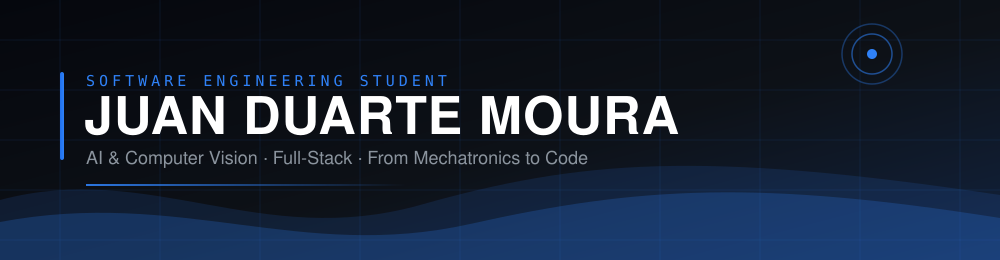

<!--
  README DE PERFIL — Juan Duarte Moura  (v4 — à prova de queda)
  O header agora é um arquivo do próprio repositório (assets/banner.svg),
  então não depende de nenhum serviço externo.
  Os cards de estatística ficaram no final, isolados: se caírem de novo,
  é só apagar aquele bloco sem estragar o resto do README.
-->

<div align="center">



<br/>

<a href="https://www.linkedin.com/in/juan-duarte-moura"></a>&nbsp;<a href="mailto:juanduarte0505008@gmail.com"></a>&nbsp;

</div>

---

## 🤖 SYSTEM CORE

```bash
╭──────────────────────────────╮
│    JUAN.SYSTEM  v2026.1      │
╰──────────────────────────────╯

Initializing...

████████████████████ 100%

✔ Mechatronics background loaded
✔ Computer vision module online
✔ Full-stack engine activated
✔ Projects mounted

STATUS: ONLINE 🚀
```

---

## 👋 About Me

```python
class JuanDuarte:
    def __init__(self):
        self.role       = "Software Engineering Student @ FIAP"
        self.background = "Mechatronics Technician (ETEC)"
        self.focus      = ["Full-Stack Dev", "AI / Computer Vision", "Automation"]
        self.location   = "São Paulo, Brazil 🇧🇷"
        self.seeking    = "Software Engineering Internship (Estágio)"
        self.fun_fact   = "I built a robotic hand controlled by a webcam"

    def current_mission(self):
        return "Turning hardware-software integration into great software."
```

Sou um desenvolvedor com base sólida em engenharia, migrando do mundo de
**robótica e sistemas embarcados** para o **desenvolvimento de software moderno**.
A formação em mecatrônica me deixa confortável na ponte entre o código e o mundo
físico — de pipelines de visão computacional a aplicações web full-stack.

---

## ⚡ Tech Stack

#### Languages


#### Frameworks & Tools


#### AI / Computer Vision


#### Hardware & Design


---

## 🚀 Featured Projects

<table>
<tr>
<td width="50%" valign="top">

### 🤟 VisuAll — Libras Recognition
> Reconhecimento de Libras em tempo real.

Sistema de IA que reconhece o **alfabeto** (modelos MLP estáticos e dinâmicos)
e **sinais corporais** (MediaPipe Holistic + LSTM). Backend e frontend unificados,
calibração facial adaptativa e arquitetura de frases por lista de tokens.

`Python` · `TensorFlow/Keras` · `MediaPipe` · `scikit-learn` · `WebSocket`

[**→ Ver projeto**](https://github.com/Juanduarte050508/VisuAll)

</td>
<td width="50%" valign="top">

### 🦾 Robotic Hand — Computer Vision (TCC)
> Projeto final do curso de Mecatrônica.

Mão robótica controlada em tempo real por webcam: Python lê os landmarks da mão
via OpenCV/MediaPipe e aciona 5 servos por meio de um Arduino.
O precursor direto do VisuAll.

`Python` · `OpenCV` · `MediaPipe` · `Arduino C++` · `Fusion 360`

[**→ Ver projeto**](https://github.com/Juanduarte050508/Engineering-Portfolio)

</td>
</tr>
</table>

---

## 🧠 Current Mission

```bash
> Loading objectives...

[██████████] VisuAll — FIAP Challenge 2026
[████████░░] Full-Stack JavaScript (React + Node + Express)
[███████░░░] Machine Learning & Computer Vision
[█████░░░░░] Estágio em Engenharia de Software

STATUS:
Never stop learning 🚀
```

- 🔭 Finalizando o **VisuAll** para o Challenge 2026 da FIAP
- 🌱 Aprofundando **Full-Stack JavaScript**
- 💼 Em busca de um **estágio em Engenharia de Software**
- 🤝 Aberto a colaborar em projetos de **IA / Visão Computacional**

---

<!-- ══════════ BLOCO OPCIONAL ══════════
     Tudo daqui até o próximo comentário depende de serviços externos
     gratuitos que vivem caindo. Se estiver quebrado, apague este trecho
     inteiro — o resto do README continua intacto.                       -->

## 📊 GitHub Analytics

<div align="center">


</div>

<!-- ══════════ FIM DO BLOCO OPCIONAL ══════════ -->

## 🐍 Contribution Animation

<div align="center">


</div>

---

<div align="center">

### 💙 "From the physical to the digital — building things that work."

⭐️ [Juan Duarte](https://github.com/Juanduarte050508)

</div>
